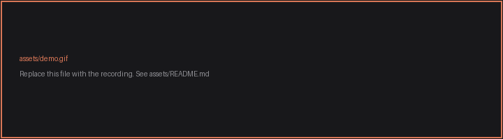

<div align="center">

# New Chat for Claude

**A PowerToys Run plugin. Type a question, press Enter, and Claude opens with your prompt already written.**

[](https://github.com/tit-exe/PowerToys-Run-for-Claude/actions/workflows/build.yml)
[](https://github.com/tit-exe/PowerToys-Run-for-Claude/releases/latest)
[](https://github.com/tit-exe/PowerToys-Run-for-Claude/releases)
[](https://learn.microsoft.com/windows/powertoys/run)
[](#-languages)
[](LICENSE)

<br>

[](https://github.com/tit-exe/PowerToys-Run-for-Claude/releases/latest/download/NewChatForClaude-1.0.0-x64.zip)
[](https://github.com/tit-exe/PowerToys-Run-for-Claude/releases/latest/download/NewChatForClaude-1.0.0-arm64.zip)

<br>



<br>

[Install](#-install) &nbsp;·&nbsp;
[Use](#-use) &nbsp;·&nbsp;
[Settings](#%EF%B8%8F-settings) &nbsp;·&nbsp;
[Languages](#-languages) &nbsp;·&nbsp;
[FAQ](#-faq) &nbsp;·&nbsp;
[Build](#-build)

</div>

> [!NOTE]
> Unofficial community plugin. Not affiliated with, endorsed by, or sponsored by Anthropic or Microsoft.

---

## ⚠️ The prompt is written, not sent

Your text lands in Claude's composer and **Claude waits for you to press Enter**. It is never submitted automatically.

**This is a safety measure built into Claude by Anthropic, not a limitation of this plugin, and no plugin can change it.** A link able to submit a prompt on its own would let any web page make Claude act without you seeing what it was told to do. The web version shows a caution banner above the composer for the same reason.

So the gesture is two keystrokes: Enter in PowerToys Run, then Enter in Claude.

## ✨ What it does

The plugin builds one link and asks Windows to open it. Nothing else.

| Destination | Link |
| :--- | :--- |
| Claude desktop app | `claude://claude.ai/new?q=...` |
| Default browser | `https://claude.ai/new?q=...` |

No network call of its own, no API key, no account, no telemetry, nothing running in the background. One assembly, one manifest, three icons. Seven files under 40 KB, with all 33 languages embedded rather than scattered across satellite folders.

### One shortcut instead of two

The Claude desktop app has its own quick entry window, on its own global shortcut. That is a second key combination to reserve, remember, and keep from colliding with everything else you have bound.

This plugin puts Claude behind the shortcut you already press. <kbd>Alt</kbd>+<kbd>Space</kbd>, `cl:`, your question: the launcher that opens your programs, converts a unit and runs a command now starts a conversation as well, and reaches the same place the quick entry window does. One shortcut, one habit, nothing else to configure.

## 📦 Install

| Requires | |
| :--- | :--- |
| PowerToys | 0.97 or later |
| Architecture | x64 or ARM64 |
| [Claude desktop app](https://claude.ai/download) | Optional. Without it, set the destination to the browser |

1. Close PowerToys.
2. Download the archive for your architecture above.
3. Extract the `NewChatForClaude` folder into `%LOCALAPPDATA%\Microsoft\PowerToys\PowerToys Run\Plugins`.
4. Start PowerToys.

Upgrading works the same way. Delete the old `NewChatForClaude` folder first so no stale files remain. Every archive ships with a `.sha256` file if you want to verify the download.

<details>
<summary>Install from source instead</summary>

<br>

```powershell
git clone https://github.com/tit-exe/PowerToys-Run-for-Claude.git
cd PowerToys-Run-for-Claude
.\scripts\deploy.ps1
```

`deploy.ps1` builds in Release and replaces the installed plugin folder. PowerToys has to be closed while its files are replaced, so the script closes it and starts it again; if it was not running, it is left closed. Run the script from an elevated prompt if PowerToys itself runs elevated, otherwise it cannot replace files the launcher holds open.

</details>

## 🚀 Use

Open PowerToys Run with <kbd>Alt</kbd>+<kbd>Space</kbd>, then type `cl:` followed by your question.

| Type | Result |
| :--- | :--- |
| `cl:` | Opens an empty chat |
| `cl: why is the sky blue` | Opens a chat with that prompt |
| `cl:why is the sky blue` | The same, the space is optional |

| Key | Action |
| :--- | :--- |
| <kbd>Enter</kbd> | Open in the configured destination |
| <kbd>Ctrl</kbd>+<kbd>Enter</kbd> | Open in the other destination |
| <kbd>Ctrl</kbd>+<kbd>C</kbd> | Copy the link |

The activation command is `cl:` and you can change it in PowerToys Settings. It ends in a colon on purpose.

<details>
<summary>Why the command ends in a colon</summary>

<br>

PowerToys matches an activation command as a plain string prefix, with no notion of a word boundary, and it hides every other plugin as soon as one matches. A command of `cl` therefore also matches `clipboard`, `class` and `clean`, and you lose your programs and files for those queries. Nothing a plugin does can bring them back, because PowerToys decides before the plugin is called.

Ending the command with a character that cannot continue a word avoids all of it. Typing `claude` then reaches your applications, exactly as it should.

If you do set a command that ends in a letter, the plugin still works when you type a space after it, and any query where the command swallowed a word shows a single result explaining what happened and what to change.

</details>

## ⚙️ Settings

One option, on the plugin's page in PowerToys Settings.

| Value | Result |
| :--- | :--- |
| The Claude app | One result, opening `claude://` |
| The default browser | One result, opening `claude.ai` |
| Both, the app first | Two results, one per destination |

If you do not have the desktop app, pick the browser.

<details>
<summary>Why there is no automatic fallback between the two</summary>

<br>

Claude ships as a packaged app, and neither the shell association APIs nor the registry report its scheme reliably from every elevation, while the launch itself succeeds. A guess would refuse links that do work, so the choice stays yours and the plugin always honours it. <kbd>Ctrl</kbd>+<kbd>Enter</kbd> opens the other destination without changing the setting.

</details>

<details>
<summary>The two greyed out options above it</summary>

<br>

Those belong to PowerToys and appear on every Run plugin. *Include in global result* answers queries typed without the activation command, and the score modifier changes how high those answers rank. In that mode, queries shorter than three characters are ignored so the plugin stays out of the way while you are still typing a file name.

</details>

## 🌍 Languages

The plugin follows the Windows display language, the same setting PowerToys itself follows. Anything not listed falls back to English.

<details>
<summary><b>33 languages</b></summary>

<br>

| | | | |
| :--- | :--- | :--- | :--- |
| العربية | Български | Català | Čeština |
| Dansk | Deutsch | Ελληνικά | English |
| Español | Suomi | Français | עברית |
| Hrvatski | Magyar | Bahasa Indonesia | Italiano |
| 日本語 | 한국어 | Norsk bokmål | Nederlands |
| Polski | Português | Português (Brasil) | Română |
| Русский | Slovenčina | Svenska | ไทย |
| Türkçe | Українська | Tiếng Việt | 简体中文 |
| 繁體中文 | | | |

</details>

They live in one embedded file, so adding a language means adding one block to it and nothing else. See [docs/LOCALIZATION.md](docs/LOCALIZATION.md). The tests check every translation against the English one for missing keys, empty values, dropped placeholders, product names translated by mistake, and a culture code Windows actually knows.

## ❓ FAQ

<details>
<summary><b>Why does it not send my prompt automatically?</b></summary>
<br>
Because Anthropic designed the link that way, and no plugin can override it. See <a href="#%EF%B8%8F-the-prompt-is-written-not-sent">the section above</a>.
</details>

<details>
<summary><b>Nothing happens when I press Enter</b></summary>
<br>
Windows could not find an application for the <code>claude://</code> link, which usually means the desktop app is not installed. Set the destination to the browser in the plugin settings, or press <kbd>Ctrl</kbd>+<kbd>Enter</kbd> to open that one result in the browser.
</details>

<details>
<summary><b>The plugin does not appear in PowerToys Run</b></summary>
<br>
Check that the <code>NewChatForClaude</code> folder sits directly inside <code>%LOCALAPPDATA%\Microsoft\PowerToys\PowerToys Run\Plugins</code> and that PowerToys was fully restarted. If you upgraded, make sure the old folder was deleted first. A plugin built against a different PowerToys version also stays hidden, which is why a PowerToys update sometimes needs a matching plugin release.
</details>

<details>
<summary><b>The plugin is in English while Windows is not</b></summary>
<br>
It follows the Windows display language, not the regional format. If your language is in the list above and still shows English, sign out and back in after changing it, then restart PowerToys.
</details>

<details>
<summary><b>Does it send anything anywhere?</b></summary>
<br>
No. The plugin has no network code at all. It builds a URL and asks Windows to open it, exactly as if you had typed the address yourself.
</details>

## 🔨 Build

Requires the [.NET 9 SDK](https://dotnet.microsoft.com/download/dotnet/9.0).

```powershell
dotnet restore NewChatForClaude.sln /p:Platform=x64
dotnet build NewChatForClaude.sln -c Release /p:Platform=x64
dotnet test NewChatForClaude.sln -c Release /p:Platform=x64
```

| Script | Purpose |
| :--- | :--- |
| `scripts\deploy.ps1` | Build and install into PowerToys Run |
| `scripts\pack.ps1` | Build release archives with checksums |

The build treats warnings as errors and runs the .NET analyzers in `Recommended` mode. Five PowerToys assemblies are compile time references only; PowerToys ships them itself, so both scripts remove them from what they copy.

Source paths are normalised out of the output and the compiler runs deterministically, so the same commit built with the same SDK version yields the same bytes twice. Every archive ships a `.sha256` next to it so you can check what you downloaded.

Further reading: [adding a language](docs/LOCALIZATION.md), [cutting a release](docs/RELEASING.md), [the `claude://` routes](https://support.claude.com/en/articles/14729294-open-claude-desktop-with-a-link), [where community plugins are listed](https://github.com/microsoft/PowerToys/blob/main/doc/thirdPartyRunPlugins.md).

## ⚖️ Trademarks

Claude and Anthropic are trademarks of Anthropic PBC. PowerToys and Windows are trademarks of Microsoft Corporation. This project is not affiliated with, endorsed by, or sponsored by either company.

The names are used only to say what this plugin connects to. Its icon is a typographic asterisk from Google's Material Symbols, under Apache 2.0. All rights in those marks remain with their owners, and the licence covers the source code only.

Full statement in [TRADEMARKS.md](TRADEMARKS.md). If a rights holder would prefer a change, open an issue and it will be made.

## 📜 License

[MIT](LICENSE) for the source code. See [TRADEMARKS.md](TRADEMARKS.md) for the names and marks, which the licence does not cover, and [THIRD-PARTY-NOTICES.md](THIRD-PARTY-NOTICES.md) for the icon and the compile time dependencies.
